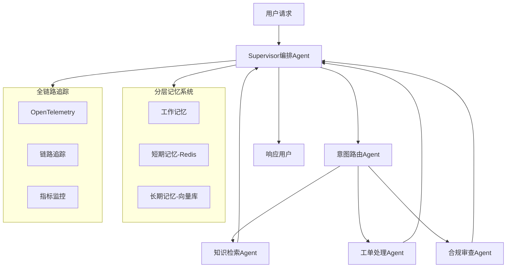

# 智能客服多Agent系统

## 一、参考项目

### 1.1 参考的企业级开源项目

| 项目 | Stars | 语言 | 核心特点 |
|------|-------|------|----------|
| AWS Agent Squad (awslabs/agent-squad) | 7,500+ | Python/TypeScript | 智能意图分类+SupervisorAgent编排+电商客服示例 |
| LangGraph Supervisor (langchain-ai/langgraph-supervisor-py) | 1,500+ | Python | Supervisor模式预构建库, 月下载63万+ |
| Spring AI Alibaba (alibaba/spring-ai-alibaba) | 9,000+ | Java | 多Agent编排(Sequential/Parallel/Routing/Loop), 管理后台可视化 |
| Eino (cloudwego/eino) | 10,300+ | Go (字节跳动) | Supervisor/Plan-Execute模式, 企业级状态管理 |
| Multi-Agent Enterprise CRM (Mrgig7) | - | Python | LangGraph+Kafka+Next.js, 销售/支持/合规Agent, 多租户+GDPR |
| SwarmAI (intelliswarm-ai/swarm-ai) | - | Java | Spring AI 1.0.4, 自改进工作流+检查点持久化 |

### 1.2 技术选型决策

**核心架构采用 Supervisor 编排模式（中心化协调）**：



## 二、核心技术亮点（面试重点）

### 2.1 Supervisor编排模式

- Supervisor作为中央协调者，接收用户请求后决定分发给哪个子Agent
- 支持并行调用多个Agent（如同时查知识库+检查合规）
- 实现 Human-in-the-Loop 断点，敏感操作需人工审批

### 2.2 分层记忆系统

- **工作记忆**：当前对话的中间推理状态（存于Agent State，进程内，零延迟）
- **短期记忆**：最近N轮对话上下文（Redis, TTL x分钟，滑动窗口淘汰）
- **长期记忆**：用户画像+历史工单+知识库（向量数据库 Chroma/FAISS/Milvus，持久化）

### 2.3 MCP工具协议

- 遵循 Model Context Protocol 标准，Agent通过 JSON-RPC 2.0 调用外部工具
- 工具包括：订单查询、工单创建、知识库搜索、风控接口
- 统一工具注册/发现机制（tools/list + tools/call），支持动态扩展

### 2.4 全链路追踪

- OpenTelemetry 标准集成，每个Agent调用生成 Span
- 追踪链路：用户请求 → Supervisor → 子Agent → 工具调用 → 响应
- 关键指标：延迟、Token消耗、Agent路由准确率、工具调用成功率

### 2.5 合规审查（金融场景）

- 两阶段机制：规则引擎毫秒级快筛 + LLM深度审查
- 检查维度：敏感词、PII泄露、越权承诺、违规金融用语
- 规则引擎保底（召回率>x%），LLM提升精确率（>x%）

## 三、面试准备材料

### 3.1 简历项目经历模板（STAR法则）

**项目名称**：智能客服多Agent系统

**S（情境）**：公司客服系统面临日均xx咨询量，人工客服响应慢（平均x分钟），知识库分散导致回答不一致，合规风险缺乏自动化审查。

**T（任务）**：作为核心开发者，负责设计并实现基于多Agent架构的智能客服系统

**A（行动）**：

- 设计 Supervisor 编排架构，实现意图路由/知识检索/工单处理/合规审查4个专业Agent
- 构建三层记忆系统（工作记忆+Redis短期记忆+md/Chroma长期记忆），解决多轮对话上下文丢失问题
- 集成 MCP 工具协议实现标准化工具调用，降低工具集成成本x%
- 基于 OpenTelemetry 搭建全链路追踪，实现Agent调用链路可视化和异常告警

**R（结果）**：

- 首问解决率从xx%提升到xx%，客户满意度从xx提升到xx
- 平均响应时间从x分钟降至x秒，日处理能力提升x倍
- Token消耗通过分层记忆+缓存策略降低x%
- 合规风险事件减少x%

sub-agent——有自己上下文和思考的工具调用
agent-team

## 四、系统总体架构

### 4.1 架构概览

本系统采用 **Supervisor编排模式**（中心化协调），由一个Supervisor Agent统一调度4个专业子Agent。

```
┌─────────────────────────┐
                          │     用户 (Web/App/API)    │
                          └────────────┬────────────┘
                                       │ HTTP/SSE
                                       ▼
                          ┌─────────────────────────┐
                          │   API Gateway (FastAPI)   │
                          │   认证 | 限流 | 日志       │
                          └────────────┬────────────┘
                                       │
                    ┌──────────────────┼──────────────────┐
                    │                  │                   │
                    ▼                  ▼                   ▼
            ┌──────────┐     ┌──────────────┐    ┌──────────────┐
            │ 短期记忆   │     │  Supervisor  │    │ 全链路追踪    │
            │  (Redis)  │◄───►│   编排Agent   │───►│(OpenTelemetry)│
            └──────────┘     └──────┬───────┘    └──────────────┘
                                    │
                    ┌───────────────┼───────────────┐
                    │               │               │
                    ▼               ▼               ▼
            ┌──────────┐   ┌──────────┐   ┌──────────────┐
            │ 知识检索   │   │ 工单处理  │   │   合规审查    │
            │  Agent    │   │  Agent   │   │    Agent     │
            │  (RAG)    │   │ (CRUD)   │   │ (规则+LLM)   │
            └────┬─────┘   └────┬─────┘   └──────────────┘
                 │               │
                 ▼               ▼
            ┌──────────┐   ┌──────────┐
            │ 长期记忆   │   │ MCP工具   │
            │(向量数据库) │   │  协议层   │
            └──────────┘   └──────────┘
```

### 4.2 编排流程（Supervisor Pattern）

```
用户请求
    │
    ▼
[Supervisor] ──── 分析意图 ──── [意图路由Agent]
    │                              │
    │ ◄──── 路由决策 ──────────────┘
    │
    ├── intent == "knowledge_rag" ──► [知识检索Agent] ──┐
    ├── intent == "ticket_handler" ──► [工单处理Agent] ──┤
    └── intent == "compliance"    ──► [合规审查Agent] ──┤
                                                        │
                            ┌───────────────────────────┘
                            ▼
                     [合规审查Agent] (所有回复必须经过)
                            │
                            ├── 通过 ──► [Supervisor汇总] ──► 响应用户
                            └── 不通过 ──► 转人工 + 创建工单
```

## 五、核心组件设计

### 5.1 Agent设计原则

每个Agent遵循**单一职责原则**：

| Agent | 职责 | 输入 | 输出 |
|-------|------|------|------|
| Supervisor | 编排调度、结果汇总 | 用户消息 + 全局State | 路由决策 + 最终回复 |
| 意图路由 | 意图分类 | 用户消息 | intent标签 + 置信度 |
| 知识检索 | RAG问答 | 用户问题 | 基于文档的回答 |
| 工单处理 | 工单CRUD | 用户需求 | 工单号 + 状态 |
| 合规审查 | 内容审查 | Agent回复内容 | 通过/不通过 + 违规项 |

### 5.2 State设计

```python
class AgentState(TypedDict):
    messages: list[BaseMessage]      # 对话消息列表
    user_id: str                      # 用户标识
    session_id: str                   # 会话标识
    intent: str                       # 识别到的意图
    sub_results: dict[str, Any]       # 各Agent的处理结果
    compliance_passed: bool           # 合规审查是否通过
    final_response: str               # 最终回复
    current_agent: str                # 当前执行的Agent
    retry_count: int                  # 重试次数
```

### 5.3 分层记忆架构

```
┌──────────────────────────────────────────────┐
│                  应用层                       │
├──────────────────────────────────────────────┤
│  工作记忆 (Working Memory)                    │
│  ├── 存储: 进程内存 (dict)                    │
│  ├── 生命周期: 单次请求                       │
│  ├── 延迟: < 1ms                             │
│  └── 用途: 当前推理状态、路由决策上下文         │
├──────────────────────────────────────────────┤
│  短期记忆 (Short-term Memory)                │
│  ├── 存储: Redis                             │
│  ├── 生命周期: TTL 30分钟                     │
│  ├── 延迟: 1-5ms                             │
│  ├── 容量: 最近20轮对话                       │
│  └── 用途: 多轮对话上下文                     │
├──────────────────────────────────────────────┤
│  长期记忆 (Long-term Memory)                 │
│  ├── 存储: FAISS / Milvus                    │
│  ├── 生命周期: 永久                           │
│  ├── 延迟: 10-50ms                           │
│  └── 用途: 知识库、用户画像、历史工单          │
└──────────────────────────────────────────────┘
```

## 六、RAG检索流程

```
用户原始问题: "怎么退钱啊"
        │
        ▼
[Query改写] ──► "退款 政策 申请 流程 时限"
        │
        ▼
[向量化] ──► Embedding(1536维)
        │
        ▼
[向量检索] ──► Top-5候选文档
        │
        ▼
[重排序] ──► LLM评估相关性 ──► Top-3文档
        │
        ▼
[上下文注入] ──► System Prompt + 文档内容 + 用户问题
        │
        ▼
[LLM生成] ──► 基于文档的回答 + 引用标注
        │
        ▼
[合规审查] ──► 检查回复合规性
        │
        ▼
最终回答 + 引用来源
```

## 七、MCP工具协议

```
┌─────────────┐    JSON-RPC 2.0    ┌─────────────────┐
│   Agent      │ ◄────────────────► │  MCP Tool Server │
│              │                    │                  │
│ tools/list   │ ──── 发现 ─────►  │  ┌─order_query  │
│ tools/call   │ ──── 调用 ─────►  │  ├─ticket_create│
│              │ ◄─── 结果 ──────  │  ├─risk_check   │
│              │                    │  └─kb_search    │
└─────────────┘                    └─────────────────┘
```

工具注册示例：

```json
{
  "name": "order_query",
  "description": "查询订单信息",
  "inputSchema": {
    "type": "object",
    "properties": {
      "order_id": {"type": "string"}
    },
    "required": ["order_id"]
  }
}
```

## 八、向量数据库对比

| 维度 | FAISS | Milvus | Pinecone |
|------|-------|--------|----------|
| 部署方式 | 嵌入式 | 分布式 | SaaS |
| 数据规模 | 千万级 | 百亿级 | 百亿级 |
| 查询延迟 | < 1ms | ~10ms | ~50ms |
| 运维复杂度 | 低 | 中 | 零 |
| 成本 | 免费 | 中等 | 高 |
| 适合阶段 | 开发/小规模 | 生产 | 快速上线 |

```

```
