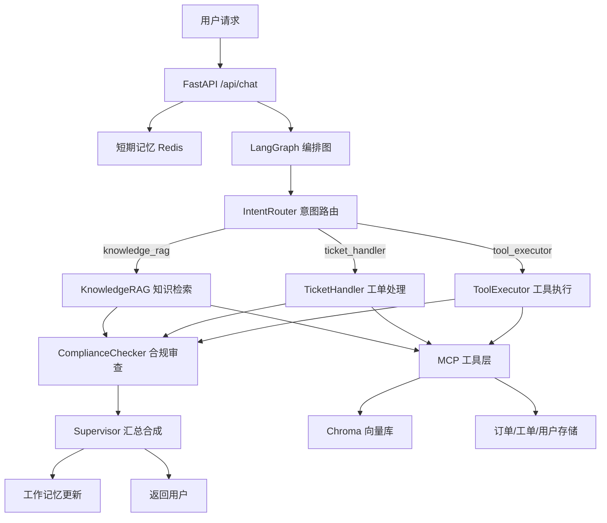
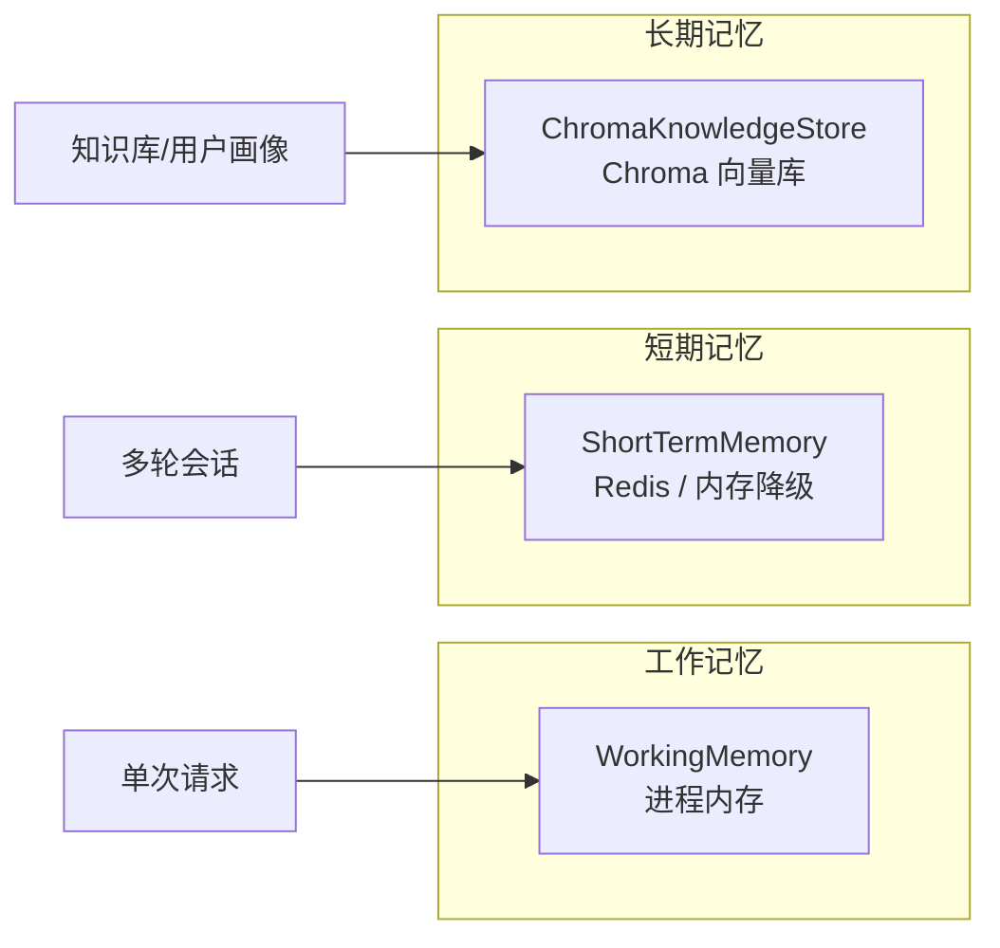
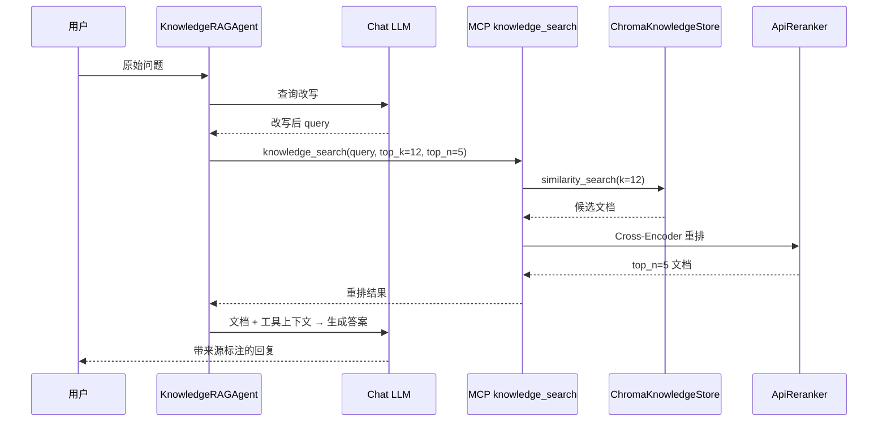
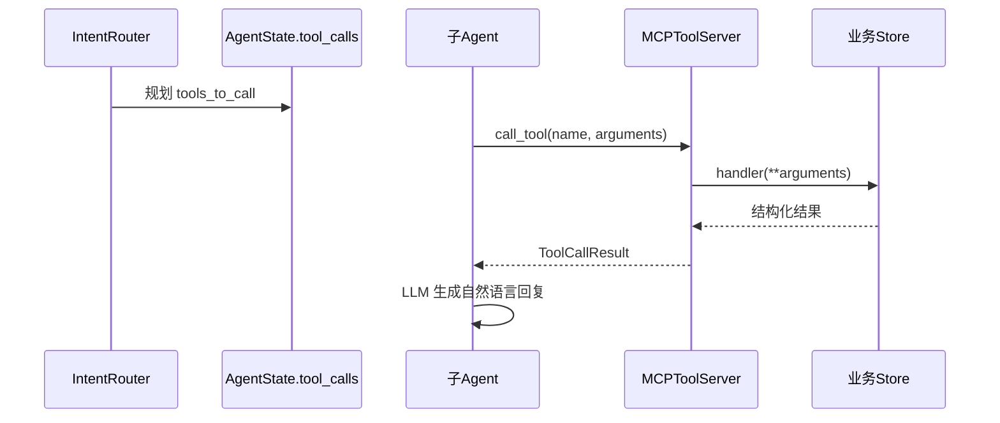

# 智能客服多 Agent 系统

---

## 目录

1. [Agent 实现](#1-agent-实现)
2. [Memory 记忆系统](#2-memory-记忆系统)
3. [RAG 检索增强生成](#3-rag-检索增强生成)
4. [FastAPI 服务实现](#4-fastapi-服务实现)
5. [工具调用实现](#5-工具调用实现)

---

## 系统总览

系统采用 **Supervisor 编排模式**：用户请求进入 LangGraph 状态图，先由意图路由 Agent 识别意图并规划工具，再路由到对应子 Agent 处理，经合规审查后由 Supervisor 汇总生成最终回复。



**核心文件位置：**

| 模块 | 路径 |
|------|------|
| Supervisor 编排 | `python-impl/agents/supervisor.py` |
| 意图路由 | `python-impl/agents/intent_router.py` |
| 知识检索 | `python-impl/agents/knowledge_rag.py` |
| 工单处理 | `python-impl/agents/ticket_handler.py` |
| 合规审查 | `python-impl/agents/compliance_checker.py` |
| 工具执行 | `python-impl/agents/tool_executor.py` |
| 记忆系统 | `python-impl/memory/` |
| RAG 基础设施 | `python-impl/rag/`、`python-impl/memory/chroma_store.py` |
| FastAPI 入口 | `python-impl/api/main.py` |
| MCP 工具 | `python-impl/mcp/mcp_server.py` |

---

## 1. Agent 实现

### 1.1 共享状态：AgentState

所有 Agent 通过 LangGraph 的 `AgentState` 共享状态，作为系统的「数据总线」：

```python
class AgentState(TypedDict):
    messages: Annotated[list[BaseMessage], add_messages]  # 对话消息（自动追加）
    user_id: str
    session_id: str
    intent: str                    # 路由目标 Agent 名称
    intent_result: dict[str, Any]  # 意图识别详情
    tool_calls: list[dict[str, Any]]  # 待执行的 MCP 工具列表
    tool_results: dict[str, Any]    # 工具执行结果
    sub_results: dict[str, Any]     # 各子 Agent 输出
    compliance_passed: bool
    final_response: str
    current_agent: str
    retry_count: int
```

- `add_messages` reducer：多节点写入 `messages` 时自动追加，不会覆盖
- `sub_results`：各 Agent 写入独立 key，避免结果互相覆盖
- `tool_calls`：由 IntentRouter 规划，供后续 Agent 消费

### 1.2 Supervisor 编排 Agent

**文件：** `agents/supervisor.py`

**职责：**

- 构建 LangGraph 状态图，定义节点与边
- 在流程末尾调用 `synthesize_response` 汇总子 Agent 结果
- 更新工作记忆（记录最近意图）

**编排流程：**

```
intent_router → [条件路由] → knowledge_rag / ticket_handler / tool_executor
                                    ↓
                            compliance_check → synthesize → END
```

**路由规则**（`route_from_intent`）：

| intent 值 | 目标 Agent |
|-----------|-----------|
| `knowledge_rag` | 知识检索 Agent（默认） |
| `ticket_handler` | 工单处理 Agent |
| `tool_executor` | 工具执行 Agent |

**汇总逻辑**（`SupervisorNode.synthesize_response`）：

1. 若合规未通过 → 返回固定转人工话术
2. 若只有一个子 Agent 有结果 → 直接返回该结果
3. 若多个子 Agent 有结果 → 调用 LLM 整合为一段连贯回复

**Checkpoint：** 使用 `MemorySaver` 支持 LangGraph 会话级检查点，通过 `thread_id = session_id` 关联。

---

### 1.3 IntentRouter 意图路由 Agent

**文件：** `agents/intent_router.py`

**职责：** 分析用户消息，识别意图、提取实体、规划 MCP 工具调用，并决定路由到哪个子 Agent。

**意图分类（IntentCategory）：**

| 类别 | 说明 |
|------|------|
| `consultation` | 产品/政策咨询 |
| `complaint` | 投诉 |
| `transaction` | 交易/订单操作 |
| `account` | 账户/会员 |
| `compliance` | 合规/风控 |
| `unknown` | 未知 |

**核心方法：**

| 方法 | 说明 |
|------|------|
| `classify()` | 调用 LLM 返回 JSON 结构化意图结果 |
| `process()` | LangGraph 节点入口，写入 `intent`、`tool_calls`、`sub_results` |
| `_fallback_tools()` | LLM 解析失败时的规则兜底（正则提取订单号/工单号等） |

**路由规则示例：**

- 产品咨询、政策、流程 → `knowledge_rag`
- 退款/投诉/开户/办理 → `ticket_handler`，工具含 `ticket_create`
- 纯订单查询/物流 → `tool_executor`，工具含 `order_query`
- 账户/会员信息 → `tool_executor`，工具含 `user_profile`
- 大额退款/转账 → `tool_executor`，工具含 `risk_check`

**输出结构（IntentResult）：**

```python
@dataclass
class IntentResult:
    primary_intent: IntentCategory
    secondary_intent: str
    confidence: float
    entities: dict[str, str]       # order_id, ticket_id 等
    suggested_agent: str           # knowledge_rag | ticket_handler | tool_executor
    tools_to_call: list[dict]      # MCP 工具调用计划
```

---

### 1.4 KnowledgeRAG 知识检索 Agent

**文件：** `agents/knowledge_rag.py`

**职责：** 基于向量检索 + Cross-Encoder 重排回答知识类问题，并可调用上下文工具（订单、用户画像）增强回答。

**处理流水线：**

```
用户问题 → 查询改写(rewrite_query)
         → 上下文工具调用(run_context_tools: order_query, user_profile)
         → 向量检索 + 重排(retrieve_documents)
         → LLM 生成答案(generate_answer)
```

**核心方法：**

| 方法 | 说明 |
|------|------|
| `rewrite_query()` | 将口语化问题改写为更适合向量检索的查询 |
| `retrieve_documents()` | 优先通过 MCP `knowledge_search` 工具检索，否则直接调用 `ChromaKnowledgeStore` |
| `run_context_tools()` | 执行 IntentRouter 规划的 `order_query`、`user_profile` 工具 |
| `generate_answer()` | 基于检索文档 + 工具结果，LLM 生成带引用来源的回复 |
| `process()` | LangGraph 节点入口 |

**回答规则（System Prompt）：**

- 严格基于检索文档与工具数据，不编造
- 信息不足时建议转人工
- 金融产品须标注免责声明
- 回答末尾标注引用来源

---

### 1.5 TicketHandler 工单处理 Agent

**文件：** `agents/ticket_handler.py`

**职责：** 处理退款、投诉、开户等业务办理类请求，通过 MCP 工具创建/查询/更新工单。

**处理逻辑：**

1. 优先消费 IntentRouter 规划的 `ticket_create` / `ticket_update` 工具调用
2. 若无预规划工具，则 LLM 分析用户消息（`analyze_request`）得到 action
3. 根据 action 执行：
   - `create` → `ticket_create` MCP 工具
   - `query` → `ticket_query` MCP 工具
   - `update` → `ticket_update` MCP 工具

**工单类型：** `refund | claim | account_open | account_change | complaint | general`

**优先级：** `low | medium | high | urgent`

---

### 1.6 ToolExecutor 工具执行 Agent

**文件：** `agents/tool_executor.py`

**职责：** 专门处理需要直接调用 MCP 工具的场景（订单查询、用户画像、风控检查等），将结构化工具结果转化为自然语言回复。

**支持工具：** `order_query`、`user_profile`、`risk_check`、`ticket_update`

**处理流程：**

```
tool_calls → run_tools() 批量调用 MCP
           → generate_answer() LLM 将 JSON 结果转为用户可读回复
```

---

### 1.7 ComplianceChecker 合规审查 Agent

**文件：** `agents/compliance_checker.py`

**职责：** 对所有子 Agent 的回复内容进行合规审查，金融/电商场景专用。

**两阶段审查机制：**

| 阶段 | 方法 | 特点 |
|------|------|------|
| 规则引擎 | `rule_check()` | 毫秒级，不依赖 LLM |
| LLM 深度审查 | `llm_check()` | 处理规则无法覆盖的语义违规 |

**规则检查项：**

- **敏感词：** 「保证收益」「稳赚不赔」「零风险」等违规金融用语
- **PII 泄露：** 手机号、身份证号、银行卡号、邮箱（正则匹配）
- **PII 脱敏：** `_mask_pii()` 对检测到的敏感信息做掩码处理

**风险等级：** `low → medium → high → critical`

**Graph 节点行为：**

- 汇总所有 `sub_results` 中的文本内容进行审查
- 若未通过，用脱敏内容替换原回复，并设置 `compliance_passed = False`
- Supervisor 在合规失败时返回转人工固定话术

---

## 2. Memory 记忆系统

系统采用**三层记忆架构**，分别对应不同时间尺度和存储介质。



### 2.1 工作记忆（WorkingMemory）

**文件：** `memory/working_memory.py`

**用途：** 维护当前对话的中间推理状态，生命周期与单次请求对齐。

**特点：**

- 进程内存储，零延迟读写
- 按 `session_id` 隔离
- 线程安全（`threading.Lock`）
- 每个 session 最多保留 50 条记录（滑动窗口）

**核心 API：**

| 方法 | 说明 |
|------|------|
| `update(session_id, data)` | 追加一条记忆并更新上下文快照 |
| `get_context(session_id)` | 获取当前 session 的完整上下文字典 |
| `get_history(session_id, last_n)` | 获取最近 N 条历史记录 |
| `export_for_persistence()` | 导出供持久化到短期/长期记忆 |

**使用场景：** Supervisor 在 `synthesize_response` 中更新 `last_intent` 和 `intent_result`；LangGraph `AgentState` 本身也承担请求级工作记忆。

---

### 2.2 短期记忆（ShortTermMemory）

**文件：** `memory/short_term.py`

**用途：** 存储最近 N 轮对话上下文，支持多轮对话连续性。

**特点：**

- 首选 **Redis** 存储（`redis://localhost:6379/0`）
- Redis 不可用时自动降级到进程内 `_fallback_store`
- 默认保留最近 **20 轮**对话
- TTL 默认 **1800 秒（30 分钟）**，自动过期
- 使用 Redis List + `LTRIM` 实现滑动窗口

**核心 API：**

| 方法 | 说明 |
|------|------|
| `add_message(session_id, role, content)` | 追加 user/assistant 消息 |
| `get_history(session_id, last_n)` | 获取对话历史 |
| `get_context_window(session_id, max_tokens)` | 按 token 估算截断的历史文本 |
| `clear(session_id)` | 清除 session 记忆 |

**在 FastAPI 中的使用：**

- 请求进入时：写入用户消息，读取最近 10 轮历史构建 `messages`
- 请求结束时：写入 assistant 回复

---

### 2.3 长期记忆（ChromaKnowledgeStore）

**文件：** `memory/chroma_store.py`（别名 `LongTermMemory`）

**用途：** 持久化存储企业知识库，支持语义检索。

**特点：**

- 基于 **LangChain Chroma** + 本地持久化目录（默认 `./vector_store/chroma`）
- 云端 Embedding API（OpenAI 兼容接口）
- Cross-Encoder 远程重排
- 文档分块：`rag_chunk_size=500`，重叠 `rag_chunk_overlap=80`

**核心 API：**

| 方法 | 说明 |
|------|------|
| `add_document(content, source, metadata)` | 添加单条文档 |
| `load_knowledge_base(kb_dir)` | 批量加载 `.txt` 知识库文件 |
| `search(query, top_k)` | 纯向量相似度检索 |
| `search_and_rerank(query, top_k, top_n)` | 向量召回 + Cross-Encoder 重排 |

**知识库来源：**

- `python-impl/knowledge_base/bitext/` — Bitext 英文客服 Q&A（按意图分组）
- `python-impl/knowledge_base/ecommerce_cn/` — 中文电商客服 FAQ
- 启动时可加载 3 条内置示例文档（`kb_seed_on_startup=true`）

---

## 3. RAG 检索增强生成

RAG 实现分布在 `rag/` 模块、`memory/chroma_store.py` 和 `agents/knowledge_rag.py` 三处。

### 3.1 整体流水线



### 3.2 Embedding 模块

**文件：** `rag/embeddings.py`

**功能：**

- 通过 `OpenAIEmbeddings` 调用 OpenAI 兼容 Embedding API
- `LengthSafeEmbeddings` 包装器：截断超长文本（默认 max 180 字符），避免 API token 限制
- 支持独立配置 Embedding 网关（`RAG_EMBEDDING_BASE_URL`、`RAG_EMBEDDING_API_KEY`）

**默认模型：** `BAAI/bge-small-zh-v1.5`

```python
def build_cloud_embeddings(settings) -> LengthSafeEmbeddings:
    raw = OpenAIEmbeddings(model=..., api_key=..., base_url=...)
    return LengthSafeEmbeddings(raw, max_chars=...)
```

### 3.3 Reranker 重排模块

**文件：** `rag/reranker.py`

**功能：**

- `ApiReranker`：调用 OpenAI 兼容 `/rerank` 端点（Cross-Encoder 远程推理）
- API 不可用时降级为 **Jaccard 词重叠** lexical score
- `rerank_documents()`：对候选 Document 打分排序，保留 top_n，写入 `rerank_score` 元数据

**默认模型：** `BAAI/bge-reranker-v2-m3`

**检索参数（可通过 `.env` 配置）：**

| 参数 | 默认值 | 说明 |
|------|--------|------|
| `RAG_TOP_K` | 12 | 向量召回候选数 |
| `RAG_TOP_N` | 5 | 重排后保留数 |
| `RAG_CHUNK_SIZE` | 500 | 文档分块大小 |
| `RAG_CHUNK_OVERLAP` | 80 | 分块重叠字符数 |

### 3.4 知识库构建

**脚本：** `scripts/build_knowledge_base.py`

将外部数据集转换为项目知识库格式：

- **Bitext CSV** → `knowledge_base/bitext/{intent}.txt`
- **电商 JSONL** → `knowledge_base/ecommerce_cn/ecommerce_faq.txt`

**索引构建方式：**

1. 启动时后台构建（`KB_BUILD_ON_STARTUP=true`，`api/startup_kb.py`）
2. 手动运行：`python scripts/build_knowledge_base.py --build-index`

**启动初始化逻辑（`startup_kb.py`）：**

- 索引已存在 → 跳过
- 有知识库文件 + `kb_build_on_startup` → 构建 Chroma 索引
- 索引为空 + `kb_seed_on_startup` → 加载 3 条内置示例
- 后台线程执行，不阻塞 HTTP 服务启动

**metadata:{'user_id':xxx}**

---


## 4. FastAPI 服务实现

**文件：** `api/main.py`

### 4.1 FastAPI 基础知识

本节介绍 FastAPI 的核心概念，并结合本项目 `api/main.py` 中的实际用法加以说明。

#### 4.1.1 FastAPI 是什么

FastAPI 是基于 **Python 类型注解** 的现代 Web 框架，底层运行在 **ASGI**（Asynchronous Server Gateway Interface）协议上，原生支持 `async/await` 异步 I/O。

| 特性 | 说明 |
|------|------|
| 高性能 | 基于 Starlette + Uvicorn，性能接近 Node.js / Go |
| 自动文档 | 启动后自动生成 Swagger UI（`/docs`）和 ReDoc（`/redoc`） |
| 类型校验 | 配合 Pydantic，请求/响应自动校验与序列化 |
| 异步原生 | 路由函数可声明为 `async def`，适合 LLM、数据库等 I/O 密集场景 |

本项目选择 FastAPI 的原因：聊天接口需要同时等待 LLM 推理、Redis 读写、向量检索等多个 I/O 操作，异步模型可以在等待期间释放事件循环处理其他请求。

#### 4.1.2 最小应用结构

一个 FastAPI 应用至少需要两步：**创建 app 实例** + **注册路由**。

```python
from fastapi import FastAPI

app = FastAPI(title="示例服务", version="1.0.0")

@app.get("/hello")
async def hello():
    return {"message": "Hello World"}
```

本项目在此基础上扩展了 `lifespan`、中间件、Pydantic 模型等：

```python
app = FastAPI(
    title="智能客服多Agent系统",
    description="基于 LangGraph 的 Supervisor 编排多 Agent 智能客服系统",
    version="1.1.0",
    lifespan=lifespan,          # 启动/关闭钩子
)
```

#### 4.1.3 路由装饰器

路由通过装饰器绑定 **HTTP 方法** 与 **URL 路径**：

```python
@app.get("/api/history/{session_id}")   # GET  + 路径参数
@app.post("/api/chat")                  # POST + JSON 请求体
@app.get("/health")                     # GET  + 无参数
```

| 装饰器 | 用途 | 本项目示例 |
|--------|------|-----------|
| `@app.get()` | 查询资源 | `/health`、`/api/tools` |
| `@app.post()` | 创建/提交数据 | `/api/chat`、`/api/tools/call` |

**路径参数（Path Parameter）：** URL 中的变量，函数参数名与 `{}` 内名称一致。

```python
@app.get("/api/history/{session_id}")
async def get_history(session_id: str):   # session_id 从 URL 提取
    ...
```

**请求体（Request Body）：** POST 请求中的 JSON 数据，通过 Pydantic 模型自动解析。

```python
@app.post("/api/chat", response_model=ChatResponse)
async def chat(request: ChatRequest):     # FastAPI 自动将 JSON → ChatRequest
    ...
```


#### 4.1.4 Pydantic 数据模型

Pydantic 的 `BaseModel` 用于定义请求/响应的数据结构，FastAPI 会自动完成：

1. **反序列化**：JSON 请求体 → Python 对象
2. **校验**：字段类型、必填项、默认值
3. **序列化**：返回值 → JSON 响应（配合 `response_model`）
4. **文档生成**：在 `/docs` 中展示字段说明

```python
from pydantic import BaseModel

class ChatRequest(BaseModel):
    message: str                          # 必填
    user_id: str = "user-1001"            # 可选，有默认值
    session_id: str | None = None         # 可选，可为 null

class ChatResponse(BaseModel):
    response: str
    session_id: str
    intent: str
    intent_result: dict
    tool_calls: list
    compliance_passed: bool
```

`response_model=ChatResponse` 的作用：

- 过滤掉响应中未在模型里声明的字段
- 确保返回 JSON 结构与文档一致
- 对响应数据做二次校验

#### 4.1.5 异步路由（async/await）

FastAPI 路由函数可以是同步或异步：

```python
# 异步（推荐用于 I/O 操作）
async def chat(request: ChatRequest):
    result = await graph.ainvoke(...)       # 等待 LangGraph 完成
    await short_term_memory.add_message(...) # 等待 Redis 写入

# 同步（适合纯 CPU 计算）
def health_check():
    return {"status": "healthy"}
```

**选择原则：**

| 场景 | 推荐写法 |
|------|---------|
| 调用 async 库（Redis、HTTP、LLM） | `async def` + `await` |
| 纯内存计算、无 I/O | `def` 即可 |

> 注意：在 `async def` 中调用阻塞式同步代码（如 `time.sleep()`、同步 HTTP）会阻塞整个事件循环。本项目所有 I/O 路径均使用 async 接口。

#### 4.1.6 异常与 HTTP 状态码

通过 `HTTPException` 返回标准 HTTP 错误响应：

```python
from fastapi import HTTPException

if graph is None:
    raise HTTPException(status_code=503, detail="系统初始化中")

try:
    result = await graph.ainvoke(...)
except Exception as e:
    raise HTTPException(status_code=500, detail=f"处理失败: {str(e)}") from e
```

| 状态码 | 含义 | 本项目使用场景 |
|--------|------|---------------|
| 200 | 成功 | 正常返回 ChatResponse |
| 503 | 服务不可用 | LangGraph 尚未初始化完成 |
| 500 | 服务器内部错误 | Agent 编排执行异常 |

FastAPI 会将 `HTTPException` 自动转为 JSON：`{"detail": "错误信息"}`。

#### 4.1.7 中间件（Middleware）

中间件在每个请求到达路由 **之前** 和响应返回 **之后** 执行，适合处理跨切面逻辑（CORS、日志、鉴权等）。

```python
from fastapi.middleware.cors import CORSMiddleware

app.add_middleware(
    CORSMiddleware,
    allow_origins=["*"],       # 允许的前端域名（生产环境应限制）
    allow_credentials=True,
    allow_methods=["*"],       # 允许的 HTTP 方法
    allow_headers=["*"],       # 允许的请求头
)
```

**CORS（跨域资源共享）：** 浏览器默认禁止前端页面访问不同域名的 API。添加 `CORSMiddleware` 后，前端（如 React 开发服务器 `localhost:3000`）才能调用后端 API（`localhost:8000`）。

#### 4.1.8 生命周期事件（lifespan）

FastAPI 通过 `lifespan` 上下文管理器管理应用启动与关闭时的资源初始化/释放（替代旧版的 `@app.on_event("startup")`）。

```python
from contextlib import asynccontextmanager

@asynccontextmanager
async def lifespan(app: FastAPI):
    # ── 启动阶段（yield 之前）──
    global graph
    init_tracer(...)
    graph = create_supervisor_graph(...)
    initialize_knowledge_base_background(...)

    yield   # ← 应用在此运行，接受 HTTP 请求

    # ── 关闭阶段（yield 之后，可选）──
    # 释放连接池、关闭 Redis 等
```

| 阶段 | 时机 | 本项目操作 |
|------|------|-----------|
| 启动 | 服务开始监听端口前 | 初始化追踪、构建 LangGraph、后台加载知识库 |
| 运行 | `yield` 期间 | 处理所有 HTTP 请求 |
| 关闭 | 进程退出时 | （当前未实现清理逻辑） |

#### 4.1.9 ASGI 服务器：Uvicorn

FastAPI 本身是框架，需要 ASGI 服务器来监听端口、分发请求。本项目使用 **Uvicorn**：

```python
# 方式一：命令行启动
uvicorn api.main:app --host 0.0.0.0 --port 8000 --reload

# 方式二：代码内启动（api/main.py 末尾）
if __name__ == "__main__":
    uvicorn.run("api.main:app", host=settings.host, port=settings.port, reload=True)
```

| 参数 | 说明 |
|------|------|
| `api.main:app` | 模块路径 `:app` 实例名 |
| `--reload` | 代码变更时自动重启（仅开发环境） |
| `--host 0.0.0.0` | 监听所有网卡，允许外部访问 |

启动后可访问：

- API 服务：`http://localhost:8000`
- 交互式文档：`http://localhost:8000/docs`
- 健康检查：`http://localhost:8000/health`

#### 4.1.10 请求处理全流程

结合上述概念，一次 `POST /api/chat` 请求的完整路径如下：

```
客户端发送 JSON
    ↓
Uvicorn 接收 HTTP 请求
    ↓
CORSMiddleware 添加 CORS 响应头
    ↓
FastAPI 路由匹配 → chat()
    ↓
Pydantic 校验 JSON → ChatRequest 对象
    ↓
async def chat() 执行业务逻辑（await LLM / Redis / Graph）
    ↓
返回 ChatResponse 对象
    ↓
Pydantic 序列化为 JSON
    ↓
Uvicorn 发送 HTTP 200 响应
```

#### 4.1.11 本项目 FastAPI 知识点对照表

| FastAPI 概念 | 本项目中的体现 |
|-------------|---------------|
| `FastAPI()` 实例 | `app = FastAPI(title=..., lifespan=lifespan)` |
| 路由装饰器 | 6 个端点：chat、history、tools、tools/call、metrics、health |
| Pydantic 模型 | `ChatRequest` / `ChatResponse` |
| 路径参数 | `{session_id}` in `/api/history/{session_id}` |
| 请求体 | POST `/api/chat` 接收 JSON body |
| `response_model` | chat 接口返回类型约束 |
| `async def` + `await` | 所有涉及 I/O 的路由均为异步 |
| `HTTPException` | 503（未初始化）、500（处理失败） |
| 中间件 | `CORSMiddleware` 允许跨域 |
| `lifespan` | 启动时构建 LangGraph、后台初始化知识库 |
| Uvicorn | `run_dev.sh` 或 `uvicorn api.main:app` 启动 |
| 自动文档 | 访问 `/docs` 可在线调试所有接口 |

---

### 4.2 应用架构

FastAPI 作为 HTTP 入口，负责：

- 依赖注入与全局单例初始化
- 会话管理（短期记忆读写）
- 调用 LangGraph 编排图处理请求
- 暴露工具、指标、健康检查等运维接口

### 4.3 生命周期（lifespan）

```python
@asynccontextmanager
async def lifespan(app: FastAPI):
    # 1. 初始化 OpenTelemetry 追踪
    init_tracer(...)

    # 2. 构建 LLM 与 LangGraph 编排图
    llm = build_chat_model(settings)
    graph = create_supervisor_graph(
        llm, working_memory, short_term_memory,
        knowledge_store, mcp_server
    )

    # 3. 后台线程初始化知识库索引
    initialize_knowledge_base_background(settings, knowledge_store)

    yield  # 服务运行中
```

**全局单例：**

| 对象 | 类型 | 说明 |
|------|------|------|
| `working_memory` | WorkingMemory | 工作记忆 |
| `short_term_memory` | ShortTermMemory | 短期记忆 |
| `knowledge_store` | ChromaKnowledgeStore | 向量知识库 |
| `mcp_server` | MCPToolServer | MCP 工具服务 |
| `order_store` / `ticket_store` / `user_store` | 业务存储 | 内存实现的模拟数据 |
| `graph` | CompiledGraph | LangGraph 编排图 |

### 4.4 API 端点

| 方法 | 路径 | 说明 |
|------|------|------|
| `POST` | `/api/chat` | 主聊天接口 |
| `GET` | `/api/history/{session_id}` | 获取会话历史 |
| `GET` | `/api/tools` | 列出所有 MCP 工具 |
| `POST` | `/api/tools/call` | 直接调用 MCP 工具（调试/集成） |
| `GET` | `/api/metrics` | Agent 指标与工具调用日志 |
| `GET` | `/health` | 健康检查（含知识库状态） |

### 4.5 聊天接口流程（`/api/chat`）

```
1. 生成/复用 session_id
2. short_term_memory.add_message(user)
3. 读取最近 10 轮历史 → 构建 LangChain messages
4. 构造 initial_state（AgentState 初始值）
5. graph.ainvoke(initial_state, config={thread_id: session_id})
6. short_term_memory.add_message(assistant)
7. 返回 ChatResponse（回复 + 意图 + 工具调用 + 合规状态）
```

**请求/响应模型：**

```python
class ChatRequest(BaseModel):
    message: str
    user_id: str = "user-1001"
    session_id: str | None = None

class ChatResponse(BaseModel):
    response: str
    session_id: str
    intent: str
    intent_result: dict
    tool_calls: list
    compliance_passed: bool
```

### 4.6 配置管理

**文件：** `config/settings.py`

通过 Pydantic Settings 从 `.env` 加载配置，支持多 LLM 提供商：

| Provider | 默认 Base URL | 默认模型 |
|----------|--------------|---------|
| deepseek | `https://api.deepseek.com/v1` | deepseek-chat |
| doubao | 火山引擎 Ark API | doubao-pro-32k |
| qwen | 阿里云 DashScope | qwen-plus |
| openai | `https://api.openai.com/v1` | gpt-4o |

### 4.7 可观测性

- **OpenTelemetry：** `tracing/otel_config.py`，每个 Agent 方法通过 `@trace_agent_call` 装饰器生成 Span
- **AgentMetrics：** 记录 Agent 调用指标
- **工具调用日志：** `mcp_server.get_call_log()` 记录每次工具调用的耗时与成败

---

## 5. 工具调用实现

工具调用基于 **MCP（Model Context Protocol）** 风格设计，实现统一的工具注册、发现与调用机制。

### 5.1 MCP 工具服务器

**文件：** `mcp/mcp_server.py`

**核心类：**

```python
@dataclass
class ToolDefinition:
    name: str
    description: str
    input_schema: dict[str, Any]   # JSON Schema
    handler: Callable[..., Awaitable[Any]]
    category: str = "general"
    requires_auth: bool = False

@dataclass
class ToolCallResult:
    tool_name: str
    success: bool
    result: Any = None
    error: str | None = None
    duration_ms: float = 0.0
```

**MCPToolServer 核心 API：**

| 方法 | 说明 |
|------|------|
| `register(name, description, input_schema)` | 装饰器注册工具 |
| `list_tools(category)` | 列出工具（含 inputSchema） |
| `call_tool(name, arguments)` | 执行工具，记录耗时与日志 |
| `handle_jsonrpc(request)` | JSON-RPC 2.0 协议入口（tools/list、tools/call、ping） |

### 5.2 内置工具一览

通过 `create_default_tools()` 注册 7 个默认工具：

| 工具名 | 分类 | 说明 | 底层存储 |
|--------|------|------|---------|
| `order_query` | order | 查询订单状态、物流 | OrderStore |
| `knowledge_search` | knowledge | 向量检索 + 重排 | ChromaKnowledgeStore |
| `ticket_create` | ticket | 创建客服工单 | TicketStore |
| `ticket_query` | ticket | 查询工单状态 | TicketStore |
| `ticket_update` | ticket | 更新工单状态/优先级 | TicketStore |
| `user_profile` | user | 查询用户画像/会员等级 | UserProfileStore |
| `risk_check` | compliance | 风控评估（金额+用户等级） | UserProfileStore |

### 5.3 工具调用链路



**三层调用关系：**

1. **IntentRouter 规划：** LLM 返回 `tools_to_call` 列表，写入 AgentState
2. **子 Agent 消费：**
   - `KnowledgeRAGAgent` → `order_query`、`user_profile`（上下文增强）
   - `TicketHandlerAgent` → `ticket_create`、`ticket_update`、`ticket_query`
   - `ToolExecutorAgent` → 执行全部规划工具
3. **MCP 统一调度：** 查找 handler → 执行 → 记录日志 → 返回 `ToolCallResult`

### 5.4 业务存储层

**文件：** `services/stores.py`

当前为**内存实现**，便于开发演示，生产环境可替换为真实 API：

| Store | 功能 | 示例数据 |
|-------|------|---------|
| `OrderStore` | 订单查询 | ORD-20260401-001（已发货）等 |
| `TicketStore` | 工单 CRUD | 动态创建 TK-YYYYMMDD-XXXXXX |
| `UserProfileStore` | 用户画像 | user-1001（黄金会员）等 |

### 5.5 JSON-RPC 协议支持

MCP Server 支持标准 JSON-RPC 2.0 调用：

```json
// tools/list
{"jsonrpc": "2.0", "method": "tools/list", "id": 1}

// tools/call
{
  "jsonrpc": "2.0",
  "method": "tools/call",
  "params": {
    "name": "order_query",
    "arguments": {"order_id": "ORD-20260401-001"}
  },
  "id": 2
}
```

REST 层也暴露了等价的 HTTP 接口（`/api/tools`、`/api/tools/call`），便于前端或外部系统集成。

### 5.6 工具调用可观测性

每次 `call_tool` 自动记录：

- 工具名称
- 成功/失败
- 耗时（毫秒）
- 时间戳
- 错误信息（如有）

可通过 `GET /api/metrics` 查看最近 20 条工具调用日志。

