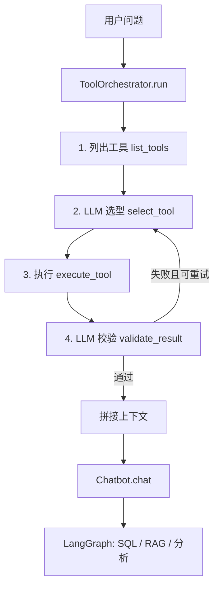

# Text2SQL 工具调用

## 1. 整体架构

工具调用发生在 **Chatbot 主流程之前**：先完成联网搜索或数据分析，再把结果作为补充上下文交给 Text2SQL / RAG 管线。



### 模块与文件

| 路径 | 作用 |
|------|------|
| `text2sql/tool_runtime/orchestrator.py` | **核心编排器** `ToolOrchestrator` |
| `text2sql/tool_runtime/local_tools.py` | 本地 `@tool`：`web_search`、`local_data_analysis` |
| `text2sql/tool_runtime/web_search_providers.py` | 联网搜索后端：博查 / SearXNG / Tavily / DuckDuckGo |
| `text2sql/tool_runtime/data_analysis.py` | 表格统计、相关性、异常点检测 |
| `text2sql/tool_runtime/mcp_tools.py` | 从 MCP 服务加载远程工具 |
| `text2sql/tool_runtime/__init__.py` | 包对外导出编排器与上下文拼接 API |
| `scripts/mcp_data_analysis_server.py` | 本地 MCP 服务（`analyze_data`） |
| `scripts/functional_chat_demo.py` | 演示入口，每轮先跑工具再 `bot.chat()` |
| `text2sql/config.py` | 工具与搜索、MCP 相关配置项 |

各文件职责及函数说明见 **[第 12 节：源文件与函数参考](#12-源文件与函数参考)**。

---

## 2. 四步流程

`ToolOrchestrator.run(user_goal)` 固定走四步，对应初学者常问的 Agent「规划 → 行动 → 反思」：

| 步骤 | 方法 | 谁来做 | 输出 |
|------|------|--------|------|
| ① 工具列表 | `list_tools()` | 程序注册 | `ToolDescriptor` 列表 |
| ② 工具决策 | `select_tool()` | **LLM** | `tool_name` + `arguments` + `rationale` |
| ③ 工具执行 | `execute_tool()` | **Python 调用工具** | 字符串结果或错误 |
| ④ 结果校验 | `validate_result()` | **LLM** | `satisfied` / `reason` / `suggest_retry` |

校验未通过且 `suggest_retry=true` 时，会带着失败原因重新执行 ②～④（次数由 `TOOLS_MAX_ATTEMPTS` 控制）。

---

## 3. 核心代码解读

### 3.1 数据结构（`orchestrator.py`）

```python
@dataclass
class ToolDescriptor:
    name: str          # 工具名，如 web_search
    description: str # 给 LLM 看的说明
    source: str        # local | mcp

@dataclass
class ToolDecision:
    tool_name: str
    arguments: dict[str, Any]
    rationale: str

@dataclass
class ToolValidation:
    satisfied: bool
    reason: str
    suggest_retry: bool = False

@dataclass
class ToolRunRecord:
    user_goal: str
    tools_listed: list[ToolDescriptor]
    runtime_notes: list[str]   # 搜索后端、MCP 状态等说明
    decision: ToolDecision | None
    tool_output: str
    tool_error: str | None
    validation: ToolValidation | None
```

一轮工具的完整状态都落在 `ToolRunRecord` 里，便于终端打印和 `--json` 导出。

### 3.2 注册工具（`_bootstrap_default_tools`）

启动 `ToolOrchestrator` 时：

1. 若开启 `tools_web_search_enabled` → 注册 `web_search`（`source=local`）
2. 若开启 `tools_local_analysis_enabled` → 注册 `local_data_analysis`
3. 若开启 `tools_mcp_enabled` 且配置了 URL 或 COMMAND → 调用 `load_mcp_tools()`，注册 MCP 返回的工具（`source=mcp`）

**注意**：SearXNG、博查等是 `web_search` 的**内部后端**，不会单独出现在工具列表第 3 项；列表里第 3 项通常是 MCP 的 `analyze_data`。

### 3.3 LLM 选型（`select_tool`）

系统提示词要求模型输出 JSON：

```json
{
  "tool_name": "analyze_data",
  "arguments": { "data_json": "...", "question": "..." },
  "rationale": "用户提供了 JSON 表格并要求相关性分析"
}
```

若不需要工具，则 `"tool_name": "none"`。

### 3.4 执行工具（`execute_tool` + `_invoke_tool_sync`）

```python
def _invoke_tool_sync(tool, arguments):
    # 1. 先试 invoke（本地 @tool）
    # 2. MCP StructuredTool 仅支持 ainvoke → asyncio.run(ainvoke)
```

MCP 工具常见报错 `StructuredTool does not support sync invocation`，已通过 `_invoke_tool_sync` 统一处理。

### 3.5 结果校验（`validate_result`）

第二个 LLM 调用，判断工具输出是否足以回答用户目标：

```json
{
  "satisfied": true,
  "reason": "已包含相关性与异常点结论",
  "suggest_retry": false
}
```

### 3.6 注入主对话（`functional_chat_demo.py`）

```python
tool_record = tool_orchestrator.run(line)
question = _enrich_question_with_tools(line, tool_record)  # 成功才拼接
out = bot.chat(question, memory_query=line)  # 记忆检索仍用原始问题
```

`tool_output_usable()` 会在以下情况**不**注入上下文，避免把错误信息塞进 Embedding：

- 工具报错、`联网搜索失败` 等前缀
- 校验 `satisfied=false`

---

## 4. 三类工具说明

### 4.1 `web_search`（本地）

- **文件**：`local_tools.py` → `web_search_providers.py`
- **作用**：根据关键词联网检索，返回标题、摘要、链接。
- **后端优先级**（`TOOLS_SEARCH_PROVIDER=auto`）：
  1. 博查（`BOCHA_API_KEY`）
  2. SearXNG（`SEARXNG_BASE_URL`）
  3. Tavily（`TAVILY_API_KEY`）
  4. DuckDuckGo（境内常失败，作回退）

### 4.2 `local_data_analysis`（本地）

- **文件**：`local_tools.py` → `data_analysis.py` 的 `run_table_analysis()`
- **输入**：`data_json`（`{"columns":[],"rows":[]}`）+ 可选 `question`
- **输出**：统计摘要、Pearson 相关性、z-score 异常点、简要结论。

### 4.3 `analyze_data`（MCP）

- **服务脚本**：`scripts/mcp_data_analysis_server.py`（FastMCP + stdio）
- **加载**：`mcp_tools.py` 中 `MultiServerMCPClient`
- **与本地分析的关系**：MCP 版 `analyze_data` 与 `local_data_analysis` 共用同一套 `run_table_analysis()` 逻辑；差别在于 MCP 可独立进程部署、供多客户端复用。

---

## 5. 配置项（`text2sql/config.py` / 环境变量）

| 配置 | 环境变量示例 | 说明 |
|------|----------------|------|
| 总开关 | `TOOLS_ENABLED=true` | 是否启用工具编排 |
| 联网模式 | `TOOLS_SEARCH_PROVIDER=auto` | auto / bocha / searxng / tavily / duckduckgo |
| 博查 | `BOCHA_API_KEY=sk-...` | 国内推荐 |
| SearXNG | `SEARXNG_BASE_URL=http://127.0.0.1:7549` | 需自建并启用 json 格式 |
| SearXNG 引擎 | `SEARXNG_ENGINES=baidu,sogou,360search,bing` | 国内引擎 |
| MCP stdio | `MCP_DATA_ANALYSIS_COMMAND=python3 scripts/mcp_data_analysis_server.py` | 推荐 |
| MCP SSE | `MCP_DATA_ANALYSIS_URL=http://127.0.0.1:3001/sse` | 需先起 SSE 网关 |
| 重试次数 | `TOOLS_MAX_ATTEMPTS=2` | 校验失败重试 |

可复制模板：`.env.mcp.example`

---

## 6. 执行命令速查

### 6.1 安装依赖

```bash
cd /path/to/text2sql_project
pip install -r requirements.txt
# 工具相关额外包（若未装全）
pip install mcp langchain-mcp-adapters duckduckgo-search
```

### 6.2 仅本地工具（联网 + 本地分析，无 MCP）

```bash
export TOOLS_ENABLED=true
export SEARXNG_BASE_URL='http://127.0.0.1:7549'   # 可选
export TOOLS_SEARCH_PROVIDER=searxng               # 或 auto + BOCHA_API_KEY

python scripts/functional_chat_demo.py --enable-tools -i
```

### 6.3 启动 SearXNG（可选，免费联网）

```bash
bash scripts/run_searxng.sh
# 容器内端口 8080，映射宿主机 7549；settings 见 deploy/searxng/settings.yml

export SEARXNG_BASE_URL='http://127.0.0.1:7549'
export TOOLS_SEARCH_PROVIDER=searxng
```

停止：`bash scripts/stop_searxng.sh`

### 6.4 启动 MCP 数据分析（stdio，推荐）

```bash
# 验证 MCP 能否加载
bash scripts/run_mcp_stdio.sh

# 运行对话
export MCP_DATA_ANALYSIS_COMMAND="python3 scripts/mcp_data_analysis_server.py"
export TOOLS_ENABLED=true
python scripts/functional_chat_demo.py --enable-tools -i
```

### 6.5 MCP SSE 模式（可选）

```bash
# 终端 1
bash scripts/run_mcp_sse.sh

# 终端 2
export MCP_DATA_ANALYSIS_URL='http://127.0.0.1:3001/sse'
export MCP_DATA_ANALYSIS_TRANSPORT=sse
python scripts/functional_chat_demo.py --enable-tools -i
```

### 6.6 批量提问（非交互）

```bash
python scripts/functional_chat_demo.py --enable-tools \
  "请联网搜索2025年跨境电商出口趋势" \
  '请用数据分析服务分析：{"columns":["region","sales"],"rows":[["华东",120],["华南",95]]}'
```

加 `--json` 可在输出中看到 `tool_run` 字段。

---

## 7. 示例问题

| 目标 | 示例提问 | 预期选用工具 |
|------|----------|----------------|
| 联网 | 请联网搜索 2025 年中国跨境电商出口最新报道，用 3 条概括 | `web_search` |
| 本地 JSON 分析 | 请对下面 JSON 统计 sales 列均值：`{"columns":["region","sales"],...}` | `local_data_analysis` |
| MCP 分析 | 请用**数据分析服务**对下面 JSON 做相关性与异常检测：{...} | `analyze_data`（需 MCP 已加载） |
| 只查库 | 数据库里 orders 表有多少行？ | `none` → 走 SQL |

---

## 8. 终端输出对照

一轮对话典型输出：

```
【工具列表】
  1. [local] web_search: ...
  2. [local] local_data_analysis: ...
  3. [mcp] analyze_data: ...
  ---
  · 「web_search」内置联网后端：SearXNG(http://127.0.0.1:7549) → ...

【工具决策】
  工具：analyze_data
  参数：{"data_json": "...", "question": "..."}

【工具执行】
  （分析报告正文）

【结果校验】
  满足目标：是

助手：
  （结合工具结果 + 数据库/RAG 的最终回答）
```

启动时 **stderr** 还会打印 `[搜索]`、`[MCP]` 等诊断行，便于排查未加载 MCP 的原因。

---

## 9. 常见问题

| 现象 | 原因 | 处理 |
|------|------|------|
| 工具列表只有 2 个 local | 未配置 MCP | 设置 `MCP_DATA_ANALYSIS_COMMAND` 并 `bash scripts/run_mcp_stdio.sh` |
| SearXNG 403 | 未启用 json 格式 | 使用 `deploy/searxng/settings.yml` + `run_searxng.sh` |
| SearXNG results 为空 | 境外引擎超时 | settings 中 `keep_only` 国内引擎 |
| `StructuredTool does not support sync` | MCP 只能异步调用 | 已修复，请更新 `orchestrator.py` |
| Embedding 413 | 失败信息被拼进记忆检索 | 已用 `memory_query=原始问题` + 失败不注入 |
| 工具成功后仍 SQL 报错 | 模型生成了非 SELECT | 问题中写明「只分析 JSON，不查库」 |

---

## 10. 扩展阅读

- LangChain Tools：https://python.langchain.com/docs/concepts/tools/
- MCP 协议：https://modelcontextprotocol.io/

---

## 11. 最小调用示例（仅 Python API）

不启动 `functional_chat_demo`，也可在脚本中直接调用编排器：

```python
from text2sql.config import Settings
from text2sql.tool_runtime import ToolOrchestrator

settings = Settings(
    tools_enabled=True,
    mcp_data_analysis_command="python3 scripts/mcp_data_analysis_server.py",
)
orch = ToolOrchestrator(settings=settings)
record = orch.run(
    '请分析 {"columns":["x"],"rows":[[1],[2],[9]]} 的异常点'
)
print(record.decision)
print(record.tool_output)
print(record.validation)
```

---

## 12. 源文件与函数参考

本节按**调用链路**列出工具编排涉及的全部文件，以及其中主要类型与函数的作用。工具层在 `functional_chat_demo.py` 中于 **Chatbot 主流程之前**执行，与 LangGraph（`graph.py`）中的 SQL / RAG / 分析路由解耦。

### 12.1 单轮时序

1. **启动**：`ToolOrchestrator` 注册 `web_search`、`local_data_analysis`、MCP `analyze_data`（若配置成功）。
2. **用户发问**：`tool_orchestrator.run(用户原话)`。
3. **`select_tool`**：LLM 输出 `{"tool_name","arguments","rationale"}`，可为 `"none"`。
4. **`execute_tool`**：调用对应 `@tool` 或 MCP 工具。
5. **`validate_result`**：LLM 判断 `satisfied`；不满足且 `suggest_retry` 时带失败原因重试选型。
6. **`_enrich_question_with_tools`**：通过校验的输出 → `【工具调用补充上下文】` + 原问题。
7. **`bot.chat(enriched_question)`**：进入原有 SQL / KB / 分析 / 记忆流程（`memory_query` 仍用原始问题）。

### 12.2 核心运行时（`text2sql/tool_runtime/`）

#### `orchestrator.py` — 编排中枢

| 类型 / 函数 | 作用 |
|-------------|------|
| `ToolDescriptor` | 工具元数据：`name`、`description`、`source`（`local` \| `mcp`） |
| `ToolDecision` | LLM 选型结果：工具名、参数、`rationale` |
| `ToolValidation` | 质检结果：是否满足目标、是否建议重试 |
| `ToolRunRecord` | 单轮完整记录（列表、决策、输出、错误、校验） |
| `tool_output_usable()` | 判断工具输出是否应注入主对话（跳过、报错、校验失败、以 `错误：` / `联网搜索失败` 等开头则不注入） |
| `build_tool_context_block()` | 将可用输出格式化为 `【工具调用补充上下文】` 文本块（超长截断至约 2000 字） |
| `ToolOrchestrator` | 编排器主类 |
| `ToolOrchestrator.__init__` | 注册工具：默认走 `_bootstrap_default_tools()`，也可传入自定义 `tools` |
| `_bootstrap_default_tools()` | 按配置注册 `web_search`、`local_data_analysis`，并尝试 `load_mcp_tools()` |
| `_append_search_startup_hint()` | 根据博查 / SearXNG 配置生成启动警告（写入 `startup_warnings`） |
| `_build_runtime_notes()` | 生成「非独立工具项」说明（搜索后端链、MCP 状态） |
| `_register_tools()` | 把 `BaseTool` 放入 `_tools` 字典并生成 `_descriptors` |
| `list_tools()` | 返回当前已注册工具的 `ToolDescriptor` 列表 |
| `format_tools_for_display()` | 格式化工具列表与 `runtime_notes`，供 stderr 打印 |
| `_parse_json_object()` | 从 LLM 回复中解析 JSON（含正则提取 `{...}` 兜底） |
| `select_tool()` | **第 1 次 LLM 调用**：根据 `_SELECT_SYSTEM` 从工具 catalog 选一个工具及参数 |
| `_invoke_tool_sync()` | 同步执行工具：优先 `invoke` → `run` → `ainvoke`（兼容 MCP 仅异步的 StructuredTool） |
| `execute_tool()` | 按 `ToolDecision` 调用具体工具，返回 `(output, error)` |
| `validate_result()` | **第 2 次 LLM 调用**：根据 `_VALIDATE_SYSTEM` 判断输出是否满足用户目标 |
| `run()` | 完整流程：列工具 → 选型 → 执行 → 校验；可重试至多 `tools_max_attempts` 次 |

#### `local_tools.py` — LangChain 本地 `@tool`

| 函数 | 作用 |
|------|------|
| `web_search(query, max_results)` | 联网搜索入口；读 `Settings` 中的 Key / URL，调用 `run_web_search()`，成功返回格式化条目，失败返回 `联网搜索失败：...` |
| `local_data_analysis(data_json, question)` | 本地表格分析；解析 JSON 后调用 `run_table_analysis()` |

#### `data_analysis.py` — 分析算法（本地工具与 MCP 共用）

| 函数 | 作用 |
|------|------|
| `_parse_table()` | 解析 `{"columns":[...],"rows":[[...]]}` |
| `_numeric_series()` | 从每列提取可解析的数值序列 |
| `_pearson()` | 两列 Pearson 相关系数 |
| `_anomalies()` | 按 z-score（默认 \|z\|≥2）标出离群行 |
| `run_table_analysis()` | **对外主入口**：生成 Markdown 报告（行列统计、相关性、异常点、简要结论） |

#### `web_search_providers.py` — 多后端搜索实现

| 函数 | 作用 |
|------|------|
| `_http_post_json()` | 通用 POST JSON HTTP 客户端（博查、Tavily） |
| `_format_line()` | 将单条搜索结果格式化为「序号. 标题 … URL」 |
| `search_bocha()` | 博查 Web Search API |
| `search_tavily()` | Tavily API |
| `search_duckduckgo()` | DuckDuckGo（多 backend 重试） |
| `_searxng_health_hint()` | SearXNG 连接失败时的排错提示文案 |
| `search_searxng()` | 请求自建 SearXNG 的 `/search?format=json` |
| `build_search_chain()` | 按 `tools_search_provider`（`auto` / `bocha` / …）组装 `(名称, 函数)` 链 |
| `run_web_search()` | 依次尝试链上各后端，返回 `(成功来源, 结果行)` 或 `(None, 错误列表)` |

#### `mcp_tools.py` — MCP 客户端加载

| 类型 / 函数 | 作用 |
|-------------|------|
| `McpLoadResult` | 加载结果：`tools`、`ok`、`message` |
| `_mcp_server_config()` | 从 `Settings` 生成 `MultiServerMCPClient` 配置：**stdio**（`mcp_data_analysis_command`）或 **SSE/HTTP**（`mcp_data_analysis_url`） |
| `diagnose_mcp_config()` | 未加载时的可读原因（给启动日志用） |
| `load_mcp_tools_async()` | 异步连接 MCP、`get_tools()`，可按 `mcp_data_analysis_tool_name` 过滤 |
| `load_mcp_tools()` | 同步封装（处理已在事件循环中的情况） |

依赖：`langchain-mcp-adapters` 的 `MultiServerMCPClient`。

#### `__init__.py` — 包对外 API

导出：`ToolOrchestrator`、`ToolRunRecord`、`build_tool_context_block`、`tool_output_usable`。

### 12.3 入口与演示脚本

#### `scripts/functional_chat_demo.py`

| 函数 | 作用 |
|------|------|
| `_print_tool_run()` | 终端打印【工具列表】【工具决策】【工具执行】【结果校验】 |
| `_enrich_question_with_tools()` | 若 `tool_output_usable`，把 `build_tool_context_block()` 拼到用户问题后 |
| `_tool_run_to_dict()` | `--json` 时序列化工具运行记录为 `tool_run` 字段 |
| `run_interactive()` / `run_batch()` | 在 `bot.chat()` **之前**调用 `tool_orchestrator.run()`，再 enriched 提问 |
| `main()` | `--enable-tools` 或 `TOOLS_ENABLED=true` 时构造 `ToolOrchestrator`，启动时 stderr 打印工具列表 |

#### `scripts/mcp_data_analysis_server.py`

| 部分 | 作用 |
|------|------|
| `FastMCP("text2sql-data-analysis")` | 创建 MCP 服务实例 |
| `analyze_data(data_json, question)` | MCP 暴露的工具；内部调用 `run_table_analysis()`（与 `local_data_analysis` 逻辑相同） |
| `mcp.run(transport="stdio")` | 以 stdio 与客户端通信（由 `MCP_DATA_ANALYSIS_COMMAND` 拉起子进程） |

#### `scripts/verify_mcp_load.py`

| 函数 | 作用 |
|------|------|
| `main()` | 未设置命令时默认 `python3 scripts/mcp_data_analysis_server.py`；调用 `diagnose_mcp_config` + `load_mcp_tools` 并打印工具名 |

#### `scripts/run_mcp_stdio.sh`

打印 stdio 环境变量示例，设置 `MCP_DATA_ANALYSIS_COMMAND` 后执行 `verify_mcp_load.py`。**不常驻进程**；正式使用时由 demo 按需拉起子进程。

#### `scripts/run_mcp_sse.sh`

用 `npx supergateway` 把 stdio MCP 转为 `http://127.0.0.1:3001/sse`，供 `MCP_DATA_ANALYSIS_URL` 模式使用（需 Node.js）。

### 12.4 联网搜索基础设施（SearXNG）

| 文件 | 作用 |
|------|------|
| `scripts/run_searxng.sh` | Docker 启动 SearXNG（compose 或 `docker run`），挂载 `deploy/searxng` |
| `scripts/stop_searxng.sh` | 停止 SearXNG 容器 |
| `docker-compose.searxng.yml` | SearXNG 编排定义 |
| `deploy/searxng/settings.yml` | SearXNG 配置（须含 `json` 格式、国内引擎等） |
| `.env.mcp.example` | MCP 与 `TOOLS_*` 环境变量模板 |

搜索相关配置项在 `text2sql/config.py` 的 `tools_*`、`bocha_*`、`searxng_*`、`mcp_*` 字段，由 `get_settings()` / 环境变量加载。

### 12.5 测试文件

| 文件 | 验证内容 |
|------|----------|
| `tests/test_tool_orchestrator.py` | 本地工具注册、`run()` 选型 / 执行 / 校验（Mock LLM） |
| `tests/test_tool_enrich.py` | 搜索失败不注入上下文；成功时 `build_tool_context_block` 含预期内容 |
| `tests/test_mcp_tool_invoke.py` | `_invoke_tool_sync` 对仅 `ainvoke` 工具可用；`run_table_analysis` 含相关性 / 异常 |
| `tests/test_web_search_providers.py` | `search_bocha` 响应解析 |

### 12.6 本地分析 vs MCP 分析

| 路径 | 工具名 | 实现 |
|------|--------|------|
| 本地 | `local_data_analysis` | `local_tools.py` → `data_analysis.run_table_analysis` |
| MCP | `analyze_data`（服务名默认 `data_analysis`） | 子进程 `mcp_data_analysis_server.py` → 同一 `run_table_analysis` |

两者算法相同；MCP 适合独立进程、远程 SSE；本地工具无需起 MCP 子进程。

### 12.7 其它参考

| 文件 | 作用 |
|------|------|
| `text2sql/config.py` | `tools_enabled`、`tools_web_search_enabled`、`tools_mcp_enabled`、`tools_search_provider`、`mcp_data_analysis_*` 等字段定义 |
| `tool_registry_example.py` | 自定义工具注册示例（非主路径依赖） |

