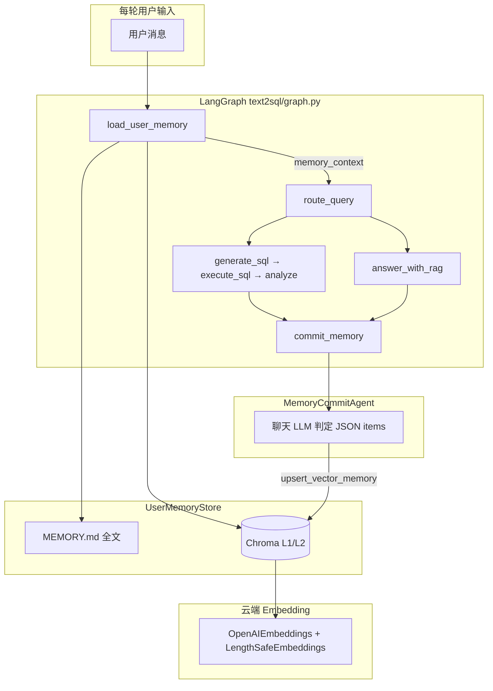
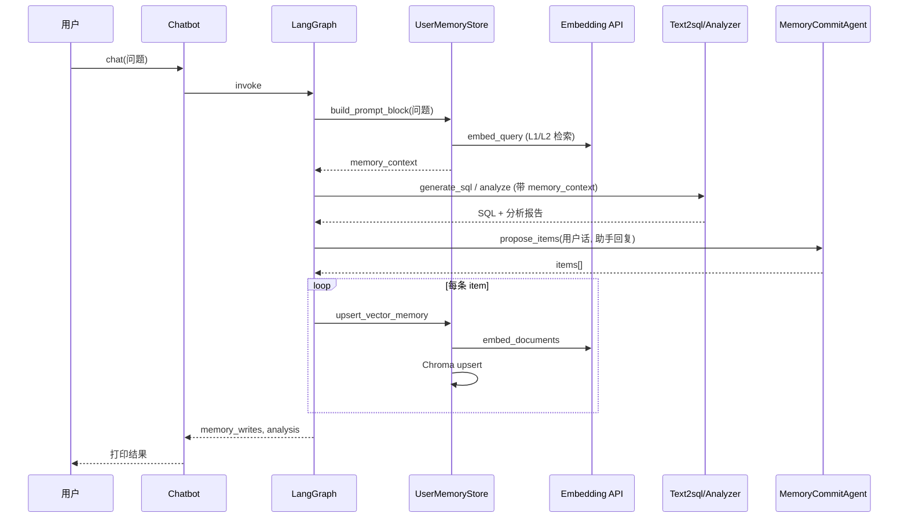

# Text2SQL 记忆系统 

---

## 1. 设计目标

记忆系统为 Text2SQL / 知识库对话提供**跨轮上下文**，分三层：

| 层级 | 存储介质 | 写入方式 | 检索方式 |
|------|----------|----------|----------|
| **长期设定** | 项目根 `MEMORY.md` | 用户**手写**维护 | 每轮**全文**注入（与当前问题无关） |
| **L1 情景记忆** | Chroma 向量库 | 每轮结束后 **LLM 判定**是否归档 | 按当前用户问题**语义检索** |
| **L2 程序性记忆** | 同上 | 同上 | 同上 |

向量计算统一走 **OpenAI 兼容 Embedding API**（与 `RagEngine` 共用 `RAG_EMBEDDING_*` / `LLM_*`），Chroma 只存向量与元数据，**不在本机加载**默认 onnx / sentence-transformers 模型。

---

## 2. 总体架构



**要点：**

- **读记忆**发生在图的最前面（`load_user_memory`），结果写入状态字段 `memory_context`。
- **写记忆**发生在每轮末尾（`commit_memory`），在 SQL 分析、RAG 回答或失败说明生成之后。
- `memory_context` 会传入 `Text2sqlAgent`、`AnalyzerAgent`、`RagEngine.ask`，作为系统或用户提示的补充块。

---

## 3. 源码文件索引

| 文件 | 职责 |
|------|------|
| `text2sql/user_memory.py` | 核心：`UserMemoryStore`、云端 embedding、Chroma 读写、提示块拼装 |
| `text2sql/memory_commit_agent.py` | 每轮结束后 LLM 判断是否写入 L1/L2，解析 JSON |
| `text2sql/graph.py` | LangGraph 节点：`load_user_memory`、`commit_memory` |
| `text2sql/chatbot.py` | 注入 `memory_store`，初始化 `GraphState` |
| `text2sql/config.py` | 记忆相关配置项 |
| `text2sql/text2sql_agent.py` | SQL 生成时注入 `memory_context` |
| `text2sql/analyzer_agent.py` | 分析报告时注入 `memory_context` |
| `text2sql/rag_engine.py` | 知识库问答时注入 `memory_context` |
| `scripts/functional_chat_demo.py` | 演示：启用记忆、打印 `memory_writes` |
| `scripts/mempalace_tutorial_demo.py` | 独立交互演示（复用 `UserMemoryStore`） |
| `MEMORY.md` | 用户长期设定（非代码自动写入） |

---

## 4. 配置项（`text2sql/config.py`）

| 字段 | 环境变量示例 | 默认值 | 说明 |
|------|----------------|--------|------|
| `memory_md_path` | `MEMORY_MD_PATH` | `MEMORY.md` | 长期记忆 Markdown，相对项目根 |
| `memory_chroma_store_path` | `MEMORY_CHROMA_STORE_PATH` 或 `MEMORY_CHROMA_FALLBACK_PATH` | `outputs/text2sql_user_memory_chroma` | Chroma 持久化目录 |
| `memory_chroma_collection` | `MEMORY_CHROMA_COLLECTION` | `text2sql_user_memory_cloud` | 集合名；勿与旧版本地 embedding 集合混用 |
| `memory_auto_commit_enabled` | `MEMORY_AUTO_COMMIT_ENABLED` | `true` | 是否每轮调用归档 LLM |
| `memory_auto_commit_max_items` | `MEMORY_AUTO_COMMIT_MAX_ITEMS` | `3` | 单轮最多写入条数；`0` 等价关闭写入 |

Embedding 相关（与 RAG 共用）：

| 字段 | 说明 |
|------|------|
| `rag_embedding_model` | API 上的 embedding 模型名 |
| `rag_embedding_api_key` | 优先于 `llm_api_key` |
| `rag_embedding_base_url` | 优先于 `llm_base_url` |
| `rag_embedding_timeout_seconds` / `max_retries` / `batch_size` | 超时与批量 |

---

## 5. 数据模型

### 5.1 向量记忆单条记录（逻辑字段）

写入 Chroma 时，业务上每条记忆对应：

```json
{
  "memory_id": "mem_a1b2c3d4e5f6",
  "user_id": "u_demo",
  "layer": "L1",
  "content": "归纳或原始记忆文本",
  "time": "2026-05-15T10:00:00+08:00",
  "tags": ["health", "habit"]
}
```

### 5.2 Chroma 元数据（`UserMemoryStore._memory_meta`）

与 MemPalace 命名习惯对齐，便于日后对接或迁移：

| 元数据键 | 含义 |
|----------|------|
| `wing` | 用户 ID（`user_id`） |
| `room` | 记忆层：`L1` 或 `L2` |
| `source_file` | `memory://{memory_id}` |
| `chunk_index` | 固定 `"0"`（单条 drawer） |
| `memory_id` / `user_id` / `layer` / `time` / `tags` | 冗余业务字段 |
| `normalize_version` | 固定 `"2"` |

### 5.3 存储正文格式（`documents`）

正文由 `_memory_doc_body` 生成，**首行带 `memory_id`**，便于检索结果缺少完整 metadata 时仍能解析：

```text
[memory_id=mem_xxx]
用户偏好：数据分析回答要先给三句话结论，再列要点。

[时间] 2026-05-15T10:00:00+08:00
[标签] habit,work
```

### 5.4 `MemoryHit`（检索结果）

`search_vector_memories` 返回 `MemoryHit` 数据类，字段包括 `content`（去掉元数据行后的展示文本）、`similarity`、`distance` 等。

---

## 6. `UserMemoryStore`（`text2sql/user_memory.py`）

### 6.1 初始化

```python
UserMemoryStore(
    settings,
    user_id="u_demo",
    project_root=None,           # 默认 text2sql 包上一级（项目根）
    chroma_store_path=None,      # 覆盖 memory_chroma_store_path
    chroma_collection=None,      # 覆盖 memory_chroma_collection
)
```

### 6.2 云端 Embedding：`build_cloud_embeddings`

- 使用 `langchain_openai.OpenAIEmbeddings`，配置与 `RagEngine` 一致。
- 外层包 `LengthSafeEmbeddings`（`rag_engine.py`），对过长文本截断后再调 API。
- 首次使用前 `_ensure_embeddings()` 会 `embed_query("ping")` 做连通性检查。

### 6.3 Chroma：避免本地模型下载

**关键设计：**

1. `PersistentClient` 创建集合时**不绑定** `embedding_function`。
2. **写入**：`embed_documents([doc])` 得到向量 → `collection.upsert(embeddings=..., documents=..., metadatas=...)`。
3. **检索**：`embed_query(query)` → `collection.query(query_embeddings=[...], where=...)`。

若只传 `documents` / `query_texts` 而不传 `embeddings`，Chroma 可能使用集合内持久化的**本地默认** embedding，从而触发模型下载。当前实现已规避该路径。

### 6.4 过滤条件：`chroma_where_wing_room`

Chroma 0.5+ 要求 `where` 顶层为单一逻辑；多字段过滤使用：

```python
{"$and": [{"wing": user_id}, {"room": "L1"}]}
```

仅按用户过滤时：`{"wing": user_id}`。

### 6.5 核心方法

| 方法 | 作用 |
|------|------|
| `read_memory_md()` | 读取 `MEMORY.md` 全文 |
| `build_prompt_block(query, l1_k=4, l2_k=4)` | 拼装注入 LLM 的记忆块（MD + L1 检索 + L2 检索） |
| `search_vector_memories(query, layer=None, n_results=6)` | 语义检索，可按层过滤 |
| `upsert_vector_memory(layer, content, tags, time_iso=None, memory_id=None)` | 写入或更新一条向量记忆 |
| `vector_count()` | 当前集合条数 |
| `memory_record_dict(...)` | 生成与业务字段一致的字典（供日志/JSON 输出） |

### 6.6 `build_prompt_block` 输出结构示例

```markdown
以下为辅助记忆，可能与当前数据库无关；回答业务问题时以数据库与检索文档为准。

### MEMORY.md（用户长期设定）
（MEMORY.md 全文）

### L1 情景记忆（检索）
- [L1] …（time=…, tags=…, sim=0.85）

### L2 程序性记忆（检索）
- [L2] …
```

---

## 7. `MemoryCommitAgent`（`text2sql/memory_commit_agent.py`）

### 7.1 职责

根据**本轮用户原话 + 助手最终回复**（及路由、SQL 摘要），调用**聊天 LLM** 输出 JSON，决定是否向 L1/L2 落库。

**不会**自动修改 `MEMORY.md`。

### 7.2 分层规则（系统提示摘要）

- **L1**：客观发生的事件（可含时间），如「昨天忘记吃药」。
- **L2**：稳定偏好、习惯、简单规则，如「回答要先给结论」。
- **不写**：纯 SQL/表名、敏感信息、与用户无关的百科、无依据猜测。

### 7.3 LLM 输出格式

```json
{
  "items": [
    {
      "layer": "L2",
      "content": "用户希望数据分析回答先给三句话结论再列要点",
      "tags": ["habit", "work"],
      "event_time": null
    }
  ]
}
```

- `items` 可为 `[]`，表示本轮不写入。
- 经 `normalize_commit_items` 校验：`layer` 仅 `L1`/`L2`，`content` 长度 ≥ 4，最多 `memory_auto_commit_max_items` 条。

### 7.4 主要 API

```python
agent = MemoryCommitAgent(settings=settings)
items = agent.propose_items(
    user_text="...",
    assistant_text="...",
    route="sql",          # 或 kb / 空
    sql_excerpt="SELECT ...",
)
# items: list[dict] 每项含 layer, content, tags, event_time
```

---

## 8. LangGraph 集成（`text2sql/graph.py`）

### 8.1 状态字段

```python
class GraphState(TypedDict):
    ...
    memory_context: str              # load_user_memory 填充，供下游 Agent/RAG
    memory_writes: list[dict[str, Any]]  # commit_memory 填充，本轮写入记录
```

### 8.2 图节点与边

```text
START
  → load_user_memory      # 检索 MD + L1/L2 → memory_context
  → route_query           # kb | sql
  → (sql 路径) generate_sql → execute_sql → analyze | retry | fail
  → (kb 路径) answer_with_rag
  → commit_memory         # LLM 判定 → upsert → memory_writes
  → END
```

三条结束路径（`analyze` / `answer_with_rag` / `fail`）都会进入 `commit_memory`。

### 8.3 `load_user_memory`

```python
def load_user_memory(state):
    if memory_store is None:
        return {"memory_context": ""}
    uq = last_user_text(state["messages"])
    block = memory_store.build_prompt_block(uq)
    return {"memory_context": block}
```

### 8.4 `commit_memory`

1. 若未注入 `memory_store` 或 `memory_auto_commit_enabled=False` 或 `max_items<=0` → 返回空 `memory_writes`。
2. 取 `last_user_text` / `last_ai_text`（本轮最后一条 AI 消息，即最终回复）。
3. `MemoryCommitAgent.propose_items(...)`。
4. 对每条 item 调用 `memory_store.upsert_vector_memory(...)`，并追加到 `memory_writes`。

### 8.5 记忆注入下游

| 组件 | 注入位置 |
|------|----------|
| `Text2sqlAgent.generate` | SystemMessage 追加「用户记忆」块 |
| `AnalyzerAgent.analyze` | SystemMessage 追加 |
| `RagEngine.ask` / 子问题路径 | 用户提示前加「【用户记忆】」 |

业务数据仍以 schema / SQL 结果 / RAG 检索为准；记忆块说明「若冲突以数据为准」。

---

## 9. `Chatbot` 入口（`text2sql/chatbot.py`）

```python
bot = Chatbot(
    settings=settings,
    thread_id="demo-thread",
    memory_store=UserMemoryStore(settings, user_id="u_demo"),  # 可选
)
out = bot.chat("用户问题")
# out 含 analysis, route, memory_writes, ...
```

- `memory_store=None` 时图中记忆节点为空操作。
- 多轮对话依赖 LangGraph `MemorySaver` + 相同 `thread_id`；**向量记忆**跨进程持久化在 Chroma 目录，与 checkpoint 无关。

---

## 10. 演示脚本 `scripts/functional_chat_demo.py`

### 10.1 启用记忆

默认创建 `UserMemoryStore`；关闭方式：

```bash
python3 scripts/functional_chat_demo.py --no-memory          # 不检索、不写入
python3 scripts/functional_chat_demo.py --no-memory-write    # 检索，但不自动写入
python3 scripts/functional_chat_demo.py --user-id u_alice
python3 scripts/functional_chat_demo.py --json               # 输出 memory_writes 等
```

### 10.2 终端如何确认「已存储」

助手回复后若出现：

```text
【本轮向量记忆写入】（由 LLM 判定）
  1. {"memory_id": "mem_...", "layer": "L2", ...}
```

表示本轮已写入 Chroma。若无该块，可能是 LLM 返回 `items: []`（判定无需记忆），不一定是故障。

### 10.3 交互命令

| 命令 | 作用 |
|------|------|
| `/mem-md` | 查看 `MEMORY.md` 路径与预览 |
| `/mem-help` | 帮助 |

L1/L2 **无** `/mem-add` 手动命令；写入由 `commit_memory` + LLM 自动完成。

### 10.4 检查向量条数

```bash
python3 -c "
from text2sql.config import get_settings
from text2sql.user_memory import UserMemoryStore
s = get_settings()
store = UserMemoryStore(s, user_id='u_demo')
print('条数:', store.vector_count())
print('目录:', store.vector_store_path)
"
```

---

## 11. 单轮时序（SQL 路径）



---

## 12. 与 RAG 知识库的区别

| 维度 | 用户记忆 L1/L2 | RAG 知识库 |
|------|----------------|------------|
| 数据来源 | 对话中 LLM 归档 | `knowledge_base/` 文档 |
| 存储目录 | `outputs/text2sql_user_memory_chroma` | `outputs/rag_store/` |
| 更新方式 | 每轮自动判定写入 | `ensure_index` / 构建脚本 |
| 用途 | 用户偏好、个人事实 | 企业文档、政策等 |
| Embedding | 同一套 API 配置 | 同一套 API 配置 |

二者向量库**目录与集合分离**，不要混用同一 Chroma 目录。

## 13.有对话但从不出现「向量记忆写入」

- 调高信息密度（明确偏好、事实），或检查 `MEMORY_AUTO_COMMIT_ENABLED` / `--no-memory-write`。
- 查看日志是否有「记忆归档 LLM 调用失败」。
---

## 14. 扩展开发建议

1. **新增记忆层**：扩展 `Layer` 类型、`_memory_meta.room`、`MemoryCommitAgent` 提示与 `build_prompt_block` 检索逻辑。
2. **MEMORY.md 自动维护**：当前刻意不做；若需要可单独增加节点，避免与 L1/L2 混淆。
3. **可观测性**：在 `functional_chat_demo` 增加 `/mem-status`（条数 + 最近 N 条摘要），或把 `memory_context` 在 `--debug` 时打印。
4. **测试**：`tests/test_memory_commit.py` 覆盖 JSON 解析；图测试见 `tests/test_graph.py`（`memory_context` 传入 Agent）。
