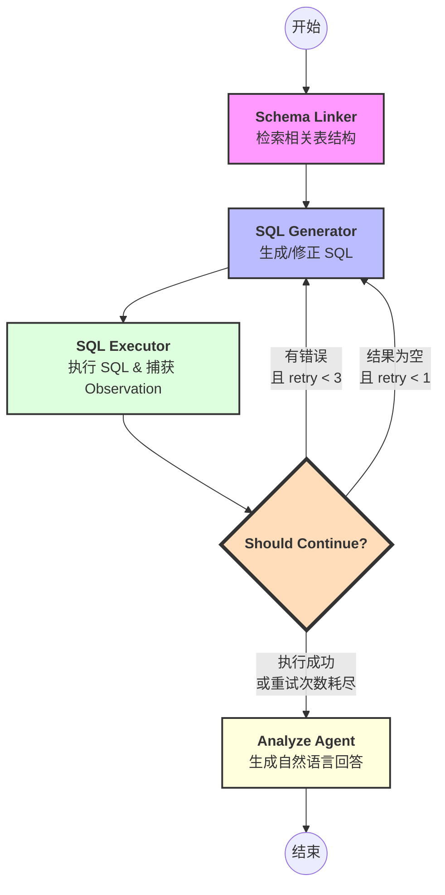

# Text2sql

## 流程图




### postgresql 创表

```sql
-- demo database下面
CREATE TABLE movies (
    id SERIAL PRIMARY KEY,
    title VARCHAR(255) NOT NULL,
    director VARCHAR(100),
    release_year INTEGER,
    genre VARCHAR(50),
    rating NUMERIC(3, 1), -- 如 9.5
    summary TEXT
);

-- 创建书籍表
CREATE TABLE books (
    id SERIAL PRIMARY KEY,
    title VARCHAR(255) NOT NULL,
    author VARCHAR(100),
    publish_year INTEGER,
    category VARCHAR(50),
    price NUMERIC(10, 2),
    stock_count INTEGER
);

-- 插入一些 Demo 数据
INSERT INTO movies (title, director, release_year, genre, rating, summary) VALUES
('星际穿越', '克里斯托弗·诺兰', 2014, '科幻', 9.4, '关于时空穿梭与爱。'),
('流浪地球', '郭帆', 2019, '科幻', 7.9, '太阳即将毁灭，人类寻找新家园。'),
('教父', '弗朗西斯·福特·科波拉', 1972, '犯罪', 9.3, '黑帮家族的兴衰史。'),
('三体', '张番番', 2025, '科幻', 8.5, '改编自同名小说。'), -- 故意加一个和书名一样的电影
('奥本海默', '克里斯托弗·诺兰', 2023, '传记', 8.8, '原子弹之父的故事。');

INSERT INTO books (title, author, publish_year, category, price, stock_count) VALUES
('三体', '刘慈欣', 2008, '科幻', 35.00, 100),
('银河系漫游指南', '道格拉斯·亚当斯', 1979, '科幻', 42.00, 50),
('百年孤独', '加西亚·马尔克斯', 1967, '文学', 58.00, 30),
('星际穿越', '基普·索恩', 2014, '科普', 68.00, 20), -- 故意加一个和电影名一样的书
('银河系漫游指南', '道格拉斯·亚当斯', 1979, '科幻', 45.00, 10);
commit;


select * from movies;
select * from books;

```


### tables_config.json

```json
{
  "tables": [
    {
      "table_name": "movies",
      "description": "存储电影的基本信息，包括导演、上映年份、类型和评分。",
      "columns": [
        {"name": "id", "description": "主键，电影唯一标识"},
        {"name": "title", "description": "电影名称"},
        {"name": "director", "description": "导演姓名"},
        {"name": "release_year", "description": "上映年份"},
        {"name": "genre", "description": "电影类型，如科幻、犯罪、动作"},
        {"name": "rating", "description": "电影评分，最高10分"}
      ],
      "sample_questions": [
        "评分高于9分的电影有哪些？",
        "诺兰导演过哪些电影？",
        "2010年之后上映的科幻电影。"
      ]
    },
    {
      "table_name": "books",
      "description": "存储书籍的基本信息，包括作者、出版年份、价格和库存。",
      "columns": [
        {"name": "id", "description": "主键，书籍唯一标识"},
        {"name": "title", "description": "书籍名称"},
        {"name": "author", "description": "作者姓名"},
        {"name": "publish_year", "description": "出版年份"},
        {"name": "category", "description": "书籍分类，如科幻、文学"},
        {"name": "price", "description": "书籍价格"},
        {"name": "stock_count", "description": "库存数量"}
      ],
      "sample_questions": [
        "刘慈欣写过什么书？",
        "价格低于50元的科幻书有哪些？",
        "库存最少的书是哪本？"
      ]
    }
  ]
}
```


### python脚本
```python
import os
import re
import json
import psycopg2
import requests
import httpx
from openai import OpenAI
from typing import List, Dict, TypedDict, Optional
from psycopg2 import extras
from pydantic_settings import BaseSettings, SettingsConfigDict
from langgraph.graph import StateGraph, END
from sklearn.feature_extraction.text import TfidfVectorizer
from sklearn.metrics.pairwise import cosine_similarity


# =========================================================
# 0) BaseSetting 配置管理
# =========================================================
os.environ["NO_PROXY"] = "10.xxx"
os.environ["no_proxy"] = "10.xxx"
class Settings(BaseSettings):
    # 自动从环境变量读取，若无则使用默认值
    ark_api_key: str = "xxx"
    api_url: str = "xxx"
    model_name: str = "xxx"
    
    db_host: str = "127.0.0.1"
    db_name: str = "demo"
    db_user: str = "postgres"
    db_pass: str = "123456"
    
    # 允许从 .env 文件读取
    model_config = SettingsConfigDict(env_file=".env", env_file_encoding="utf-8")

# 实例化全局配置
config = Settings()


# =========================================================
# 1) 定义状态机数据结构
# =========================================================
class AgentState(TypedDict):
    query: str
    schema_info: str
    generated_sql: str
    sql_result: str
    error_msg: str
    retry_count: int
    final_answer: str

# =========================================================
# 2) LLM 核心调用逻辑
# =========================================================

def call_chat_model(messages: list) -> str:
    try:
        # trust_env=False 禁用代理读取
        http_client = httpx.Client(
            verify=False,
            timeout=60.0,
            trust_env=False
        )

        client = OpenAI(
            api_key=config.ark_api_key,
            base_url=config.api_url+"/v1",
            http_client=http_client
        )

        response = client.chat.completions.create(
            model=config.model_name,
            messages=messages,
            max_tokens=1024,
            temperature=0.2
        )

        return response.choices[0].message.content
    except Exception as e:
        return f"LLM调用异常: {str(e)}"


# =========================================================
# 3) LangGraph 节点实现
# =========================================================

def schema_linker_node(state: AgentState):
    print("\n[Node: Schema Linker] 正在检索相关表结构...")
    with open("D://LLM_learn//tables_config.json", "r", encoding="utf-8") as f:
        table_data = json.load(f)

    table_docs = [f"{t['table_name']} {t['description']}" for t in table_data["tables"]]
    vectorizer = TfidfVectorizer()
    tfidf_matrix = vectorizer.fit_transform(table_docs)
    query_vec = vectorizer.transform([state["query"]])
    scores = cosine_similarity(query_vec, tfidf_matrix)[0]

    print(f"[DEBUG] TF-IDF scores: {dict(zip([t['table_name'] for t in table_data['tables']], scores))}")

    
    top_indices = scores.argsort()[-2:][::-1]
    selected = [table_data["tables"][i] for i in top_indices if scores[i] > 0.1]

    # 如果没有匹配到任何表，返回所有表作为 fallback
    if not selected:
        print("[DEBUG] 无匹配表，返回所有表")
        selected = table_data["tables"]

    schema_text = ""
    for t in selected:
        schema_text += f"\nTable: {t['table_name']}\nColumns: "
        schema_text += ", ".join([c['name'] for c in t['columns']]) + "\n"

    return {"schema_info": schema_text}

def sql_generator_node(state: AgentState):
    # 每次进入这个节点都增加重试计数（因为是重试时必经的节点）
    current_retry = state.get('retry_count', 0) + 1
    print(f"\n[Node: SQL Generator] (当前重试次数: {current_retry})")

    system_prompt = f"""你是一个 PostgreSQL 专家。请根据 Schema 生成一条 SELECT 语句。
【当前 Schema】: {state['schema_info']}
【历史报错/反馈】: {state.get('error_msg', '无')}

要求：
1. 必须在 'Thought: ' 后写出你的逻辑分析。
2. 最终 SQL 必须紧跟在 'Final SQL: ' 之后。
3. 尽可能使用 ILIKE 进行模糊匹配。
4. 禁止任何修改数据的操作。
"""
    messages = [
        {"role": "system", "content": system_prompt},
        {"role": "user", "content": state["query"]}
    ]
    response = call_chat_model(messages)
    
    # 正则提取 SQL
    sql_match = re.search(r"Final SQL:\s*(.*)", response, re.DOTALL | re.IGNORECASE)
    sql = sql_match.group(1).strip() if sql_match else ""
    sql = sql.replace("```sql", "").replace("```", "").strip()
    # 去掉可能的 * 符号
    sql = sql.lstrip("*").strip()

    print(f"[DEBUG] 生成的SQL: {sql}")

    return {"generated_sql": sql, "retry_count": current_retry}

def sql_executor_node(state: AgentState):
    print("\n[Node: SQL Executor] 正在连接数据库执行...")
    sql = state["generated_sql"]
    conn = None
    try:
        conn = psycopg2.connect(
            host=config.db_host,
            database=config.db_name,
            user=config.db_user,
            password=config.db_pass
        )
        with conn.cursor(cursor_factory=extras.DictCursor) as cur:
            cur.execute(sql)
            res = [dict(r) for r in cur.fetchall()]
            print(f"-> 执行成功，找到 {len(res)} 条数据")
            return {"sql_result": str(res), "error_msg": ""}
    except Exception as e:
        print(f"-> ❌ 执行失败: {str(e)}")
        return {"error_msg": str(e), "sql_result": "[]"}
    finally:
        if conn: conn.close()

def analyze_agent_node(state: AgentState):
    print("\n[Node: Analyze Agent] 正在生成最终答案...")
    prompt = f"""请根据以下数据回答用户的问题。
用户问题：{state['query']}
SQL 语句：{state['generated_sql']}
查询结果：{state['sql_result']}
报错信息：{state['error_msg']}

要求：如果结果为空，请分析原因并给予建议；如果查询成功，请总结核心信息。"""
    
    response = call_chat_model([{"role": "user", "content": prompt}])
    return {"final_answer": response}


# =========================================================
# 4) 路由逻辑与图构建
# =========================================================

def should_continue(state: AgentState):
    """条件边：决定是重试还是结束"""
    # 有执行错误时，重试最多3次
    if state["error_msg"]:
        if state["retry_count"] < 3:
            print(f"[DEBUG] 有错误，准备重试 {state['retry_count']}/3")
            return "retry"
        else:
            print(f"[DEBUG] 错误重试已达3次，结束")
            return "end"

    # 执行成功但无数据时，只重试1次
    if state["sql_result"] == "[]":
        if state["retry_count"] < 1:
            # 自动构造重试反馈
            state["error_msg"] = "结果为空。请检查查询条件（如大小写或全名），尝试放宽过滤条件。"
            print(f"[DEBUG] 结果为空，准备重试 {state['retry_count']}/1")
            return "retry"
        else:
            print(f"[DEBUG] 结果为空重试已达1次，结束")
            return "end"

    # 有数据，结束
    print(f"[DEBUG] 查询有结果，结束")
    return "end"

def build_graph():
    workflow = StateGraph(AgentState)
    
    workflow.add_node("schema_linker", schema_linker_node)
    workflow.add_node("sql_generator", sql_generator_node)
    workflow.add_node("sql_executor", sql_executor_node)
    workflow.add_node("analyze_agent", analyze_agent_node)
    
    workflow.set_entry_point("schema_linker")
    workflow.add_edge("schema_linker", "sql_generator")
    workflow.add_edge("sql_generator", "sql_executor")
    
    workflow.add_conditional_edges(
        "sql_executor",
        should_continue,
        {"retry": "sql_generator", "end": "analyze_agent"}
    )
    workflow.add_edge("analyze_agent", END)
    
    return workflow.compile()


# =========================================================
# 5) 主程序运行
# =========================================================
if __name__ == "__main__":
    agent_app = build_graph()
    
    # 测试问题集（涵盖了跨表、模糊匹配和空结果）
    queries = [
        "找一下评分最高的电影名称和导演",
        "有没有哪本书和电影的名字是一模一样的？", # 跨表联查逻辑
        "查询所有名字里带‘三’的作品",        # 模糊匹配测试
        "帮我找一本价格超过1000元的科幻书"     # 触发“结果为空”重试逻辑
    ]
    for q in queries:
        print(f"\n\n==正在处理提问:{q}===")
        final_state = agent_app.invoke({"query":q,"retry_count":0})
        print(f"\nAI回答 ：\n{final_state['final_answer']}")
